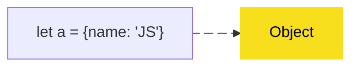

# JS.CORE Masterclass: Project Architecture & Contribution Guide

This guide is the single source of truth for the architecture, design patterns, and engineering standards of the JS.CORE Masterclass platform. All future contributions must strictly adhere to these guidelines to ensure the project remains scalable, performant, and maintainable.

---

## 1. Project Philosophy

- **Static-First & Minimalist:** The project intentionally avoids heavy frontend frameworks (React, Next.js) because documentation content is largely static. A Vanilla HTML/JS approach yields incredibly fast loading times and zero hydration overhead.
- **Convention Over Configuration:** We rely on shared templates, global CSS variables, and native DOM APIs. "Clever" abstractions that obscure standard web technologies are rejected in favor of explicit, readable code.
- **Performance by Default:** We optimize for low JavaScript payloads. Heavy libraries are lazy-loaded, and static delivery is offloaded to Vercel's Edge Network.
- **Maintainability First:** We prioritize a codebase where any developer can open an HTML file and immediately understand its structure without needing to learn a proprietary templating system.

---

## 2. Folder Structure Rules

The project structure is designed to separate source code (processed by Vite) from static assets (copied by Vite) and raw content (HTML).

```text
/
├── docs/                 # Raw content: All documentation HTML pages go here
├── public/               # Static assets ONLY: Images, fonts, favicons
├── src/                  # Source code: CSS and JS modules (processed by Vite)
│   ├── styles/           # CSS Architecture
│   └── scripts/          # JavaScript modules
├── templates/            # HTML partials (nav.html, footer.html)
├── vite.config.js        # Build tool configuration (handles layout injection)
├── vercel.json           # Vercel deployment and redirect rules
└── package.json          # Dependencies and scripts ("type": "module")
```

### Strict Rules:

- **`public/` is for pure static assets ONLY.** NEVER place `.js` or `.css` files in `public/`. Vite skips the build pipeline for `public/`, meaning CSS wouldn't be minified and JS wouldn't be bundled.
- **`src/` is for code.** All styles and scripts must reside here and be referenced relative to `src/` in HTML files.

---

## 3. Rules For Creating New Pages

When adding a new module (e.g., `async.html`), you must follow these standards.

### Required HTML Structure

```html
<!doctype html>
<html lang="hy">
    <head>
        <meta charset="UTF-8" />
        <meta name="viewport" content="width=device-width, initial-scale=1.0" />
        <title>JS.CORE | [Page Title]</title>
        <meta name="description" content="[SEO description]" />

        <!-- Correct relative paths to src/ -->
        <link
            rel="shortcut icon"
            href="../public/images/programmer.png"
            type="image/x-icon"
        />
        <link rel="stylesheet" href="../src/styles/style.css" />
        <script type="module" src="../src/scripts/main.ts"></script>

        <!-- Dynamic Navigation Slot -->
        <script type="layout-slot" id="nav-links">
            <a href="#section1" class="nav-link">Section 1</a>
        </script>
    </head>
    <body>
        <!-- LAYOUT_NAV -->
        <main class="main-content">
            <!-- Content wrapped in glass-card containers -->
        </main>
        <!-- LAYOUT_FOOTER -->
    </body>
</html>
```

### New Page Checklist

- [ ] Uses `<!doctype html>` and `<html lang="hy">`.
- [ ] Contains `<meta name="description">` with an accurate summary.
- [ ] Imports `../src/styles/style.css` and `../src/scripts/main.ts` correctly.
- [ ] Uses `<!-- LAYOUT_NAV -->` and `<!-- LAYOUT_FOOTER -->` exactly as written.
- [ ] Wraps all content blocks in `<div class="glass-card">`.
- [ ] Contains a single `<h1>` tag within `<header>`.

---

## 4. CSS Architecture Rules

We use a single-source-of-truth CSS architecture built on Native CSS Variables, avoiding Tailwind or inline styles to maintain semantic HTML.

### Naming Conventions

Use descriptive, component-based class names (BEM-inspired but relaxed):

- `glass-card`: Container abstraction.
- `text-dimmed`: Utility class for typography.
- `card-header-small`: Specific component typography.

### Best Practices

✅ **DO: Use CSS Variables**

```css
/* Good */
.button {
    background-color: var(--js-yellow);
    color: var(--bg-primary);
}
```

❌ **DON'T: Hardcode colors or duplicate styles**

```css
/* Bad */
.button {
    background-color: #f7df1e; /* Hardcoded */
}
```

❌ **DON'T: Specificity Wars**

```css
/* Bad */
main.main-content div.glass-card p { ... }
```

---

## 5. JavaScript Architecture Rules

Keep JS minimal. The primary script (`src/scripts/main.ts`) handles global interactions.

### Lazy-Loading Rules

Never import heavy dependencies synchronously at the top of the file.
✅ **DO: Dynamic Import**

```javascript
const initHeavyLibrary = async () => {
    if (document.querySelectorAll(".trigger-element").length > 0) {
        const { default: library } = await import("library-name");
        library.init();
    }
};
```

### DOM Querying

Scope DOM queries to specific containers when possible to avoid accidental collisions.

```javascript
// Prefer querySelectorAll on specific parents over document-wide
const container = document.querySelector(".glass-card");
const buttons = container.querySelectorAll(".btn");
```

---

## 6. Mermaid Diagram Standards

Mermaid diagrams are used to visually explain complex concepts (e.g., prototype chains, memory heap).

### Implementation Rules

1. Wrap the diagram in `<div class="mermaid">`.
2. Do **NOT** add script tags for Mermaid in the HTML file. `main.js` handles lazy-loading automatically.
3. Use the established styling format to match the dark theme:



### When NOT to use Mermaid:

- If the diagram is a simple 2-box flow, standard HTML/CSS Flexbox is lighter and faster.

---

## 7. Performance Standards

Vercel provides edge caching, but the frontend must remain lean.

### Performance Review Checklist

- [ ] **Lighthouse Goal:** 95+ on Performance, Accessibility, and SEO.
- [ ] **No Render-Blocking JS:** Heavy scripts (Mermaid) are strictly lazy-loaded.
- [ ] **Image Optimization:** All images must be compressed (WebP preferred) and served from `public/`.
- [ ] **Code Splitting:** Rely on Vite to split chunks automatically via dynamic `import()`.

---

## 8. SEO Standards

To ensure maximum discoverability, all pages must meet these standards.

### Required SEO Setup

```html
<title>JS.CORE | Arrays</title>
<meta
    name="description"
    content="Խորացված ուղեցույց JavaScript մասիվների (Arrays) վերաբերյալ։"
/>
<meta property="og:title" content="JS.CORE | Arrays" />
<meta
    property="og:description"
    content="Խորացված ուղեցույց JavaScript մասիվների վերաբերյալ։"
/>
<meta property="og:type" content="article" />
```

### Hierarchy Rules

- One `<h1>` per page (Page Title).
- Sequentially ordered `<h2>` (Section Labels), `<h3>` (Subsections), and `<h4>` (Feature Headers).

---

## 9. Vercel Deployment Standards

Vercel acts as our CDN and routing engine.

- **Clean URLs:** Handled automatically by `vercel.json` (`"cleanUrls": true`). A request to `/docs/array` serves `/docs/array.html`.
- **Redirects:** Managed server-side. Never use client-side `<meta http-equiv="refresh">`.
    ```json
    // vercel.json
    "redirects": [
      { "source": "/", "destination": "/docs", "permanent": true }
    ]
    ```
- **Caching:** Vite fingerprints assets in `dist/assets/`, allowing Vercel to cache them aggressively (immutable).

---

## 10. Code Review Standards

Before merging or deploying any changes, review against this checklist:

- [ ] **Architecture:** Are source files in `src/` and static files in `public/`?
- [ ] **Duplication:** Is there inline CSS or JS that should be moved to `style.css` or `main.js`?
- [ ] **Performance:** Was a new dependency added? Is it lazy-loaded?
- [ ] **Accessibility:** Do all images have `alt` tags? Is color contrast sufficient?
- [ ] **SEO:** Is the `<meta name="description">` unique for the new page?

---

## 11. Anti-Patterns To Avoid

❌ **Inline Scripts/Styles:** `<script>console.log()</script>` or `<div style="color: red">`.
_Why:_ Defeats caching, violates Content Security Policies, and creates maintenance nightmares.

❌ **Global CSS Pollution:** Using raw element selectors (`div { padding: 10px }`) outside of reset blocks.
_Why:_ Causes unpredictable side effects across other pages.

❌ **Synchronous Heavy Imports:** `import mermaid from 'mermaid'` at the top of a file.
_Why:_ Blocks page rendering and forces users to download 500kb of JS even if they don't view a diagram.

❌ **Client-Side Redirects:** `window.location.href = '/docs'`.
_Why:_ Terrible for SEO and creates a flash of unstyled content (FOUC). Rely on Vercel (`vercel.json`).

❌ **Deeply Nested Relative Paths:** `../../../public/images/`.
_Why:_ Fragile. The flat `docs/` structure ensures `../` is always sufficient.

---

## 12. Future Scalability Guidance

The current Vite + Vanilla HTML architecture is perfect for a lean documentation platform. However, you should consider evolving the architecture under these conditions:

1. **When to adopt MDX / Markdown:** If you add a blog, or if non-developers begin writing documentation content. Markdown is easier to author than raw HTML.
2. **When to adopt Astro or VitePress:** If the HTML boilerplate (`<!-- LAYOUT_NAV -->`, `<head>` tags) becomes too tedious to duplicate manually across 50+ pages. Astro natively supports components and Markdown while compiling to zero-JS static HTML, making it the perfect upgrade path from this architecture.
3. **When to adopt a CMS:** If content needs to be updated dynamically without triggering Git commits.

Until those thresholds are reached, **keep it simple, keep it fast, and avoid overengineering.**
